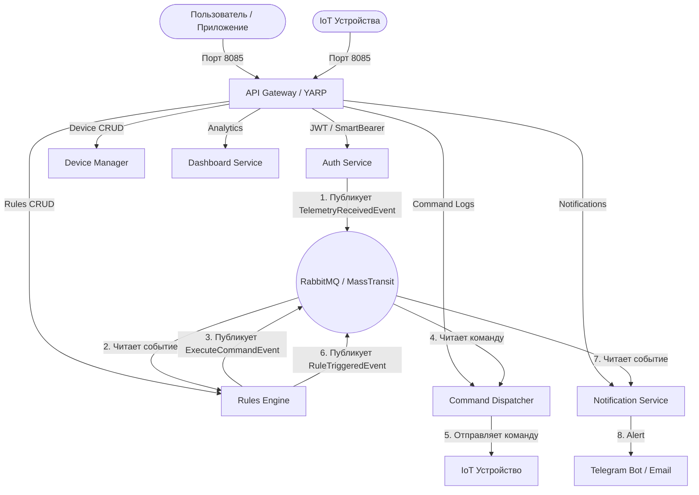

# 🎓 Защита дипломного проекта: «Домовой» (Domovoy)
## Автономная распределенная система автоматизации умного дома
**Курс:** Otus «C# ASP.NET Core разработчик»  
**Авторы:** Дмитрий Шадчнев, Павел Романцов, Нодари Гвалия, Накыпов Эрмек  

---

## 📌 1. Введение и актуальность

### Проблематика
Современные IoT-экосистемы сталкиваются с рядом вызовов:
1. **Высокая частота входящих данных**: сотни и тысячи датчиков генерируют непрерывный поток телеметрии, который может перегрузить монолитную архитектуру.
2. **Разнородность протоколов**: IoT-устройства работают по HTTP, MQTT, Zigbee, WebSockets.
3. **Безопасность**: разделение привилегий между пользователями (владельцами комнат/устройств) и IoT-устройствами, защита от подделки телеметрии.
4. **Требование к автономности и скорости реакции**: правила автоматизации (например, «если обнаружен дым — перекрыть клапан газа») должны отрабатывать мгновенно и независимо от доступности внешних сервисов.

### Цель проекта
Разработать масштабируемую, отказоустойчивую микросервисную платформу для управления умным домом с поддержкой гибких сценариев автоматизации, мультитенантной авторизации и событийной диспетчеризации команд.

---

## 🏛 2. Архитектурные решения и паттерны

### 1. Архитектурный стиль: Event-Driven Microservices
- **Изоляция сбоев**: Падение сервиса уведомлений или аналитики не влияет на прием телеметрии и выполнение критических сценариев.
- **Асинхронность**: Поток телеметрии отвязан от вычисления правил и отправки команд через шину сообщений **RabbitMQ** и шину событий **MassTransit**.
- **Независимое масштабирование**: Сервис приема телеметрии и брокер могут горизонтально масштабироваться под миллионы запросов без масштабирования тяжелой бизнес-логики.

### 2. Топология микросервисов


### 3. Выбор технологического стека
- **YARP (Yet Another Reverse Proxy)**: Высокопроизводительный reverse-proxy от Microsoft. Позволяет динамически маршрутизировать трафик, валидировать заголовки и обогащать контекст пользователя данными из Redis без оверхеда.
- **OpenIddict + ASP.NET Core Identity**: Полноценный OAuth 2.0 / OpenID Connect сервер. Поддерживает Password Grant, Introspection и гибкую генерацию JWT/JWE токенов.
- **SmartBearer Policy Scheme**: Собственный механизм гибридной аутентификации. Микросервисы прозрачно принимают как пользовательские зашифрованные JWE-токены (через introspection), так и легковесные Device-JWT для IoT-устройств.
- **PostgreSQL 16 + EF Core (DbContextFactory)**: Использование фабрик контекстов БД в консьюмерах MassTransit исключает гонки потоков при параллельной обработке событий.
- **Redis 7**: Распределенный кэш для оперативного хранения прав (`domovoy:claims:{userId}`), истории аудита и снапшота телеметрии устройств.
- **Polly**: Реализация паттерна Retry Policy с экспоненциальным backoff при отправке управляющих команд на сетевые устройства.
- **NCalc**: Безопасный динамический парсинг и исполнение предикатов условий в правилах без компиляции непроверенного C#-кода.

---

## 🔍 3. Ключевые подсистемы и технические решения

### 🔐 1. Подсистема безопасности (Auth & Identity)
- **Разделение сущностей**: Пользователь (`AuthUser`) и Устройство (`DeviceCredential`).
- **Секреты устройств**: При регистрации устройства генерируется криптографически стойкий секрет (Base64 URL-safe). В БД хранится только безопасный хэш.
- **Проверка владения (Ownership Validation)**: Прием телеметрии проверяет соответствие URL `DeviceId` и `DeviceId`, зашитого в криптографической подписи токена.

### ⚡ 2. Конвейер телеметрии и правил (Telemetry & Rules Engine)
1. Устройство отправляет JSON `{"temperature": 26.5, "status": "ON"}` на `POST /api/devices/{id}/telemetry`.
2. Auth Service публикует `TelemetryReceivedEvent(DeviceId, Data, Timestamp)`.
3. MassTransit доставляет событие в `TelemetryRuleEvaluator`.
4. Движок загружает активные правила для устройства и через `NCalc` проверяет условие `temperature > 25`.
5. При истинности условия публикуется `ExecuteCommandEvent("turn_on")`.

### 🚀 3. Диспетчеризация и исполнение команд (Command Dispatcher)
- Поддержка протоколов: **HTTP**, **MQTT**, **Zigbee**.
- Полный жизненный цикл команды в БД (`CommandLogs`): `pending` ➔ `success` / `failed`.
- Сохранение времени отправки (`SentAt`), времени завершения (`CompletedAt`) и подробного текста ошибки при сбое.

### 🔔 4. Уведомления и мониторинг
- Интеграция с Telegram Bot API (`Telegram.Bot`) и SMTP (`MailKit`).
- Prometheus эндпоинты метрик + готовые дашборды Grafana.
- Health Checks (`/health`) на уровне каждого контейнера для оркестратора Docker.

---

## 🎬 4. План демонстрации на защите (Live Demo Script)

Для наглядной демонстрации перед комиссией подготовлен автоматический сценарий:

### Шаг 1. Демонстрация инфраструктуры
Показать запущенные контейнеры в терминале:
```powershell
docker compose ps
```
*Акцент:* Все 13 контейнеров находятся в статусе `Up (healthy)`.

### Шаг 2. Запуск сквозного E2E-теста
Запустить готовый проверочный скрипт:
```powershell
powershell -File "./Final-Demo.ps1"
```
*Что происходит во время теста:*
1. **User Auth**: Выпуск OAuth 2.0 токена администратора.
2. **Device Register**: Регистрация нового сетевого устройства `demo-XXXXX`.
3. **Device Auth**: Получение IoT-устройством своего Device-JWT.
4. **Telemetry Submit**: Отправка показаний датчика (температура 24.8°C).
5. **RabbitMQ Publish**: Проверка фиксации события в обменнике шины.
6. **Active Consumer**: Проверка наличия активного обработчика очередей MassTransit.
7. **Redis Storage**: Чтение оперативного снапшота данных из Redis.
*Результат:* `Passed: 7 | Failed: 0 | System is ready for demonstration!`

### Шаг 3. Демонстрация реакции движка правил
Показать запись выполнения команды в базе данных:
```powershell
docker exec domovoy-postgres psql -U postgres -d domovoy_auth -c "SELECT \"Command\", \"Status\", \"Protocol\", \"Endpoint\", \"CompletedAt\" FROM \"CommandLogs\" ORDER BY \"CreatedAt\" DESC LIMIT 1;"
```
*Результат:* Статус команды `success`, протокол `HTTP`, целевой адрес `http://domovoy-mock-device:8080/api/command`.

### Шаг 4. Мониторинг и дашборды
- Показать панель очередей в **RabbitMQ Management UI** (`http://localhost:15672`).
- Показать метрики сервисов в **Grafana** (`http://localhost:3000`).

---

## 💡 5. Возможные вопросы комиссии и ответы

### В1: Почему для правил был выбран NCalc, а не Roslyn / Dynamic C#?
> **Ответ:** Вычисление пользовательских выражений через Roslyn или C# Scripting несет уязвимости безопасности (выполнение произвольного кода / Remote Code Execution) и потребляет значительно больше памяти из-за компиляции сборок. NCalc предоставляет строго ограниченный математический и логический контекст в изолированном AST, что безопасно и работает быстрее.

### В2: Как решается проблема Dual-Write (БД + RabbitMQ)?
> **Ответ:** В архитектуре разделены зоны ответственности: сервис авторизации сначала сохраняет состояние и генерирует событие, а консьюмеры MassTransit используют встроенный механизм повторов (Retry Policy) и идемпотентную обработку на стороне БД (Outbox pattern / уникальные идентификаторы сообщений).

### В3: Как устроена безопасность при обращении через Gateway?
> **Ответ:** Клиент обращается к шлюзу YARP. Шлюз проверяет подпись JWT-токена, через Middleware обращается в Redis и обогащает HTTP-заголовки внутренними клеймами пользователя (`X-Domovoy-UserId`, `X-Domovoy-Roles`). Микросервисы во внутренней сети доверяют этим заголовкам либо дополнительно валидируют токен по схеме `SmartBearer`.

### В4: Что произойдет, если брокер сообщений RabbitMQ временно недоступен?
> **Ответ:** Прием телеметрии и команд оснащен встроенными политиками повторов (MassTransit + Polly). В случае недоступности брокера health-check сервиса переходит в `Unhealthy`, балансировщик временно снимает нагрузку, а при восстановлении соединения сообщения из очередей обрабатываются без потери данных.

---

## 📈 6. Перспективы развития проекта
1. **gRPC / WebSockets Streaming**: Для высокоскоростной двусторонней передачи видеопотоков и телеметрии в реальном времени.
2. **AI-ассистент автоматизации**: Интеграция LLM для создания сценариев на естественном языке («Если никого нет дома после 23:00 — выключи весь свет и включи охрану»).
3. **Kubernetes Helm Charts**: Упаковка решения для масштабирования в кластерах k8s / k3s.
