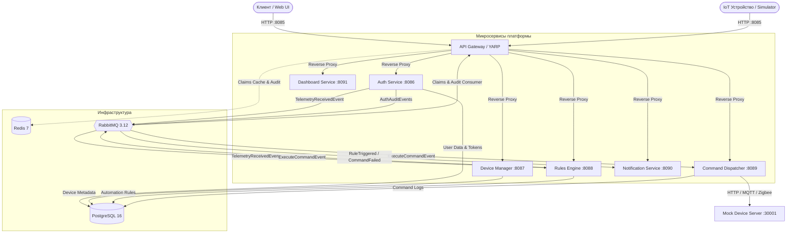
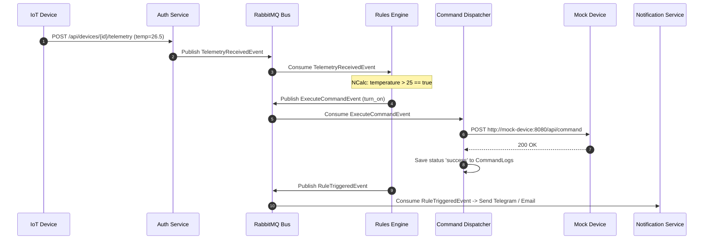

# 🏠 Домовой (Domovoy) — Автономная система автоматизации умного дома

**Дипломный проект курса «C# ASP.NET Core разработчик» (Otus 2026)**

«Домовой» — это распределенная, отказоустойчивая микросервисная IoT-платформа для управления устройствами умного дома, мониторинга телеметрии, настройки сценариев автоматизации и диспетчеризации команд.

---

## 👥 Команда разработки
- **Дмитрий Шадчнев**
- **Павел Романцов**
- **Нодари Гвалия**
- **Накыпов Эрмек**

---

## 📑 Содержание
1. [Архитектура системы](#-архитектура-системы)
2. [Стек технологий](#-стек-технологий)
3. [Структура решения и сервисы](#-структура-решения-и-сервисы)
4. [Событийно-ориентированная модель (RabbitMQ + MassTransit)](#-событийно-ориентированная-модель)
5. [Безопасность и авторизация](#-безопасность-и-авторизация)
6. [Быстрый старт и развертывание](#-быстрый-старт-и-развертывание)
7. [Тестирование и верификация (E2E)](#-тестирование-и-верификация-e2e)
8. [Мониторинг и наблюдаемость](#-мониторинг-и-наблюдаемость)
9. [Спецификация API (Endpoints)](#-спецификация-api)

---

## 🏛 Архитектура системы

Проект спроектирован в парадигме **Event-Driven Microservices Architecture** с использованием единого API Gateway (YARP), распределенного кэша (Redis), шины сообщений (RabbitMQ) и реляционного хранилища (PostgreSQL).



### Основные потоки данных (Data Flows):
1. **Аутентификация и регистрация**: Пользователи и устройства регистрируются через `Auth Service`, получая JWT-токены для последующих вызовов.
2. **Поток телеметрии**: IoT-устройство отправляет метрики на Gateway -> Auth Service валидирует токен и публикует `TelemetryReceivedEvent` в RabbitMQ, а также сохраняет последнее состояние в Redis.
3. **Оценка правил**: `Rules Engine` слушает события телеметрии, вычисляет предикаты (через NCalc) и при выполнении условий публикует `ExecuteCommandEvent`.
4. **Исполнение команд**: `Command Dispatcher` считывает событие, проверяет протокол устройства (HTTP/MQTT/Zigbee) и направляет управляющий сигнал на конечное устройство.

---

## 🛠 Стек технологий

- **Платформа**: .NET 8 / .NET 9 (C# 12 / 13), ASP.NET Core
- **API Gateway**: YARP (Yet Another Reverse Proxy), Redis Claims Enrichment Middleware
- **Авторизация**: OpenIddict 5.7 (OAuth 2.0 / OpenID Connect), ASP.NET Core Identity, JWT Bearer (HS256)
- **Брокер сообщений**: RabbitMQ 3.12, MassTransit 8 (Publish/Subscribe, Retry Policies)
- **Базы данных и кэширование**: 
  - PostgreSQL 16 (Entity Framework Core, Code-First Migrations, Connection Pooling, DbContextFactory)
  - Redis 7 (StackExchange.Redis — кэш прав доступа, история аудита, оперативная телеметрия)
- **Движок правил**: NCalc (динамический парсинг и вычисление логических выражений)
- **Отказоустойчивость**: Polly (HTTP Retry policies с экспоненциальной задержкой)
- **Фронтенд**: Blazor WebAssembly / Server
- **Мониторинг**: Prometheus, Grafana, ASP.NET Core Health Checks
- **Контейнеризация**: Docker, Docker Compose

---

## 📦 Структура решения и сервисы

| Сервис | Порт (Host:Container) | Описание и ответственность |
| :--- | :--- | :--- |
| **`Domovoy.ApiGateway`** | `8085:8080` | Единая точка входа. Проксирование маршрутов, проверка JWT, обогащение заголовков (`X-Domovoy-UserId`), кэширование прав в Redis. |
| **`Domovoy.Auth.Service`** | `8086:8080` | Аутентификация пользователей и IoT-устройств. Выпуск токенов, управление секретами, прием входящей телеметрии. |
| **`Domovoy.DeviceManager.Service`** | `8087:8080` | Управление метаданными устройств (названия, комнаты, назначенный протокол и сетевой Endpoint). |
| **`Domovoy.RulesEngine.Service`** | `8088:8080` | CRUD правил автоматизации (например, `temperature > 25`). Реактивная оценка условий по событиям телеметрии. |
| **`Domovoy.CommandDispatcher.Service`** | `8089:8080` | Прием команд на исполнение, маршрутизация по протоколам (HTTP, MQTT, Zigbee), логирование статусов в `CommandLogs`. |
| **`Domovoy.Notification.Service`** | `8090:8080` | Отправка оповещений пользователям через Telegram-бота (`Telegram.Bot`) и Email (`MailKit`). |
| **`Domovoy.Dashboard.Service`** | `8091:8080` | Агрегация статистики, сводки по устройствам и телеметрии для пользовательского интерфейса. |
| **`Domovoy.MockDevice.Server`** | `30001:8080` | Сервер-заглушка для эмуляции реального IoT-устройства, принимающего HTTP POST команды. |
| **`Domovoy.Web`** | `5200:8080` | Веб-интерфейс управления умным домом на Blazor. |
| **`Domovoy.IoTSimulator`** | — | Консольный генератор телеметрии для нагрузочного и E2E тестирования. |

---

## 🔄 Событийно-ориентированная модель

Микросервисы общаются асинхронно через RabbitMQ с помощью библиотеки **MassTransit**:



### Основные контракты событий (`Domovoy.Shared.Events`):
- `TelemetryReceivedEvent`: `DeviceId`, `Data` (JSON), `Timestamp`
- `ExecuteCommandEvent`: `DeviceId`, `Command`, `Params`, `SourceRuleId`, `Timestamp`
- `CommandExecutedEvent` / `CommandFailedEvent`: Результат выполнения команды
- `RuleTriggeredEvent`: Уведомление о срабатывании правила автоматизации
- `UserLoggedInEvent` / `UserLoggedOutEvent`: Аудит событий жизненного цикла сессий
- `DeviceLinkedEvent` / `DeviceRevokedEvent`: Обновление кэша прав в Gateway

---

## 🔒 Безопасность и авторизация

1. **User Authentication**: 
   - OAuth 2.0 Password Grant Flow (`POST /connect/token`) через **OpenIddict**.
   - Ротация Refresh-токенов (`POST /api/auth/refresh`), аудит входа/выхода.
2. **Device Authentication**:
   - Регистрация устройства пользователем (`POST /api/devices/register`), генерация криптостойкого секрета.
   - Аутентификация IoT-устройства (`POST /api/device-auth/authenticate`) с получением легковесного Device-JWT.
3. **SmartBearer Authentication Policy**:
   - Микросервисы (`DeviceManager`, `RulesEngine`) поддерживают гибридную схему `SmartBearer`: прозрачно валидируют как OpenIddict JWE-токены через introspection, так и стандартные HS256 JWT-токены.
4. **Data Protection**:
   - Настроена общая персистентность ключей `DataProtection` для корректной валидации токенов в Docker/Linux среде.

---

## 🚀 Быстрый старт и развертывание

### Предварительные требования:
- Установленный **Docker Desktop** (с поддержкой Docker Compose)
- **.NET 8.0 / 9.0 SDK** (для локальной сборки и запуска тестов)
- **PowerShell 7+** или Windows PowerShell 5.1

### Запуск всего комплекса:
1. Клонируйте репозиторий:
   ```bash
   git clone https://github.com/dshadchnev/domovoy.git
   cd domovoy
   ```
2. Перейдите в папку инфраструктуры и запустите контейнеры:
   ```powershell
   cd infra
   docker compose up -d --build
   ```
3. Проверьте статус готовности сервисов:
   ```powershell
   docker compose ps
   ```
   *Все контейнеры должны перейти в статус `healthy`.*

---

## 🧪 Тестирование и верификация (E2E)

### 1. Запуск модульных и интеграционных тестов:
```powershell
dotnet test Domovoy.sln
```
*В решении покрыты тестами авторизация, валидация сценариев, консьюмеры MassTransit, контроллеры и доменные сущности.*

### 2. Сквозной E2E тест полного цикла:
В проект включен автоматизированный сценарий проверки интеграции всех микросервисов:
- Получение токена пользователя
- Регистрация устройства и привязка Endpoint
- Создание правила автоматизации (`temp > 25 -> turn_on`)
- Аутентификация устройства и отправка телеметрии (`temperature = 26.5`)
- Ожидание прохождения через шину событий
- Проверка реальной отправки команды на Mock Device и запись статуса в базу данных PostgreSQL
- Очистка тестовых сущностей

**Запуск E2E теста:**
```powershell
powershell -File "./Final-Demo.ps1"
```

---

## 📊 Мониторинг и наблюдаемость

В инфраструктуру включен готовый стек мониторинга:
- **Prometheus**: `http://localhost:9090` — сбор системных и прикладных метрик ASP.NET Core.
- **Grafana**: `http://localhost:3000` (логин: `admin`, пароль: `admin`) — дашборды мониторинга активности сервисов и очередей сообщений.
- **RabbitMQ Management**: `http://localhost:15672` (логин: `admin`, пароль: `admin`) — просмотр очередей, обменников и консьюмеров.
- **Health Checks**: Каждый сервис предоставляет эндпоинт `/health` (проверка соединения с БД, RabbitMQ и Redis).

---

## 🔌 Спецификация API

Все запросы направляются через единый Gateway: `http://localhost:8085`

### 1. Авторизация (`/api/auth`, `/connect`)
- `POST /connect/token` — получение Access и Refresh токенов по паролю.
- `POST /api/auth/register` — регистрация нового пользователя.
- `POST /api/auth/login` — вход в систему.
- `POST /api/auth/refresh` — ротация и обновление токена.
- `POST /api/auth/logout` — отзыв сессии.

### 2. Устройства и телеметрия (`/api/devices`, `/api/device-auth`, `/api/device-mgmt`)
- `POST /api/devices/register` — привязка нового устройства к текущему пользователю.
- `POST /api/device-auth/authenticate` — получение JWT-токена устройством по секрету.
- `POST /api/devices/{id}/telemetry` — отправка показаний датчиков устройства.
- `GET /api/device-mgmt` — получение списка всех зарегистрированных устройств.
- `PUT /api/device-mgmt/{id}` — обновление настроек протокола (HTTP/MQTT/Zigbee) и эндпоинта.

### 3. Правила автоматизации (`/api/rules`)
- `GET /api/rules` — список активных правил пользователя.
- `POST /api/rules` — создание правила (условие, команда, параметры, приоритет).
- `PUT /api/rules/{id}` — редактирование правила.
- `DELETE /api/rules/{id}` — удаление правила.

### 4. Команды и аналитика (`/api/commands`, `/api/dashboard`)
- `GET /api/commands/logs/{deviceId}` — история отправленных команд и их статус выполнения.
- `POST /api/commands/retry/{logId}` — повторная отправка упавшей команды.
- `GET /api/dashboard/stats` — сводная аналитика системы.
