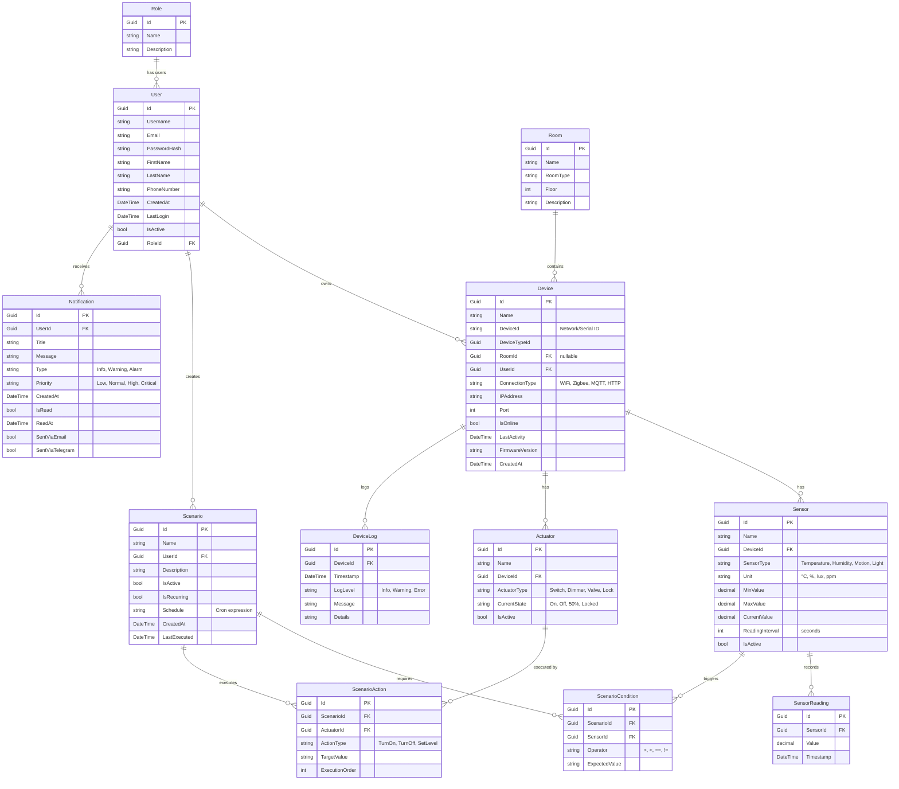

# 📊 Entity Relationship Diagram (ERD) — Domovoy.Domain

Диаграмма сущностей доменной модели системы «Домовой» (`Domovoy.Domain.Entities`).

```mermaid
erDiagram
    Role ||--o{ User : "has users"
    User ||--o{ Device : "owns"
    User ||--o{ Scenario : "creates"
    User ||--o{ Notification : "receives"
    
    Room ||--o{ Device : "contains"
    
    Device ||--o{ Sensor : "has"
    Device ||--o{ Actuator : "has"
    Device ||--o{ DeviceLog : "logs"
    
    Sensor ||--o{ SensorReading : "records"
    Sensor ||--o{ ScenarioCondition : "triggers"
    
    Actuator ||--o{ ScenarioAction : "executed by"
    
    Scenario ||--o{ ScenarioCondition : "requires"
    Scenario ||--o{ ScenarioAction : "executes"

    User {
        Guid Id PK
        string Username
        string Email
        string PasswordHash
        string FirstName
        string LastName
        string PhoneNumber
        DateTime CreatedAt
        DateTime LastLogin
        bool IsActive
        Guid RoleId FK
    }

    Role {
        Guid Id PK
        string Name
        string Description
    }

    Room {
        Guid Id PK
        string Name
        string RoomType
        int Floor
        string Description
    }

    Device {
        Guid Id PK
        string Name
        string DeviceId "Network/Serial ID"
        Guid DeviceTypeId
        Guid RoomId FK "nullable"
        Guid UserId FK
        string ConnectionType "WiFi, Zigbee, MQTT, HTTP"
        string IPAddress
        int Port
        bool IsOnline
        DateTime LastActivity
        string FirmwareVersion
        DateTime CreatedAt
    }

    Sensor {
        Guid Id PK
        string Name
        Guid DeviceId FK
        string SensorType "Temperature, Humidity, Motion, Light"
        string Unit "°C, %, lux, ppm"
        decimal MinValue
        decimal MaxValue
        decimal CurrentValue
        int ReadingInterval "seconds"
        bool IsActive
    }

    SensorReading {
        Guid Id PK
        Guid SensorId FK
        decimal Value
        DateTime Timestamp
    }

    Actuator {
        Guid Id PK
        string Name
        Guid DeviceId FK
        string ActuatorType "Switch, Dimmer, Valve, Lock"
        string CurrentState "On, Off, 50%, Locked"
        bool IsActive
    }

    DeviceLog {
        Guid Id PK
        Guid DeviceId FK
        DateTime Timestamp
        string LogLevel "Info, Warning, Error"
        string Message
        string Details
    }

    Scenario {
        Guid Id PK
        string Name
        Guid UserId FK
        string Description
        bool IsActive
        bool IsRecurring
        string Schedule "Cron expression"
        DateTime CreatedAt
        DateTime LastExecuted
    }

    ScenarioCondition {
        Guid Id PK
        Guid ScenarioId FK
        Guid SensorId FK
        string Operator ">, <, ==, !="
        string ExpectedValue
    }

    ScenarioAction {
        Guid Id PK
        Guid ScenarioId FK
        Guid ActuatorId FK
        string ActionType "TurnOn, TurnOff, SetLevel"
        string TargetValue
        int ExecutionOrder
    }

    Notification {
        Guid Id PK
        Guid UserId FK
        string Title
        string Message
        string Type "Info, Warning, Alarm"
        string Priority "Low, Normal, High, Critical"
        DateTime CreatedAt
        bool IsRead
        DateTime ReadAt
        bool SentViaEmail
        bool SentViaTelegram
    }
```